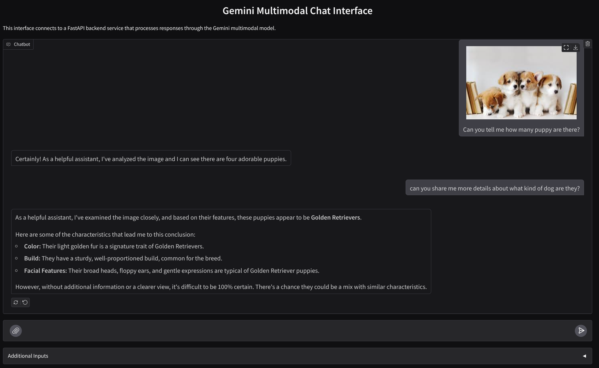

# Multimodal Chat Assistant Prototype Using Gemini

This repository contains a prototype of a multimodal chat assistant using Google Gemini.
Built using Gradio for the frontend and FastAPI as the backend



## How To

### Trying Out Locally

- If you are running this demo on local machine, run the command below to generate the JSON file

    ```shell
    gcloud auth application-default login
    ```

- After that, create virtual environment and install dependencies. If you are using [uv](https://docs.astral.sh/uv/) run the following command:

    ```shell
    uv sync --frozen
    ```

    or if you just use python directly

    ```shell
    pip install -r requirements.txt
    ```

    The following command will asume using uv, where `uv run` command is equal to `python` command

- Copy the `settings.yaml.example` to `settings.yaml` and update the `VERTEXAI_PROJECT_ID` and `VERTEXAI_LOCATION` accordingly

- Run the backend service

    ```shell
    uv run backend.py
    ```

- Then in the separate terminal run the frontend service

    ```shell
    uv run frontend.py
    ```

- If succeeded, you can access the Web UI in the `http://0.0.0.0:7860`

### Deploying to CloudRun

- Copy the `settings.yaml.example` to `settings.yaml` and update the `VERTEXAI_PROJECT_ID` and `VERTEXAI_LOCATION` accordingly

- Run the following command

    ```shell
    gcloud run deploy --source . \
                      --env-vars-file settings.yaml \
                      --port 7860
    ```
