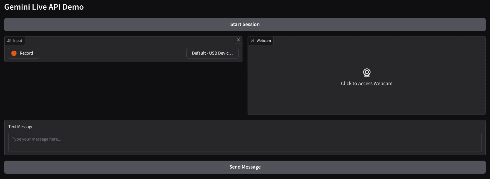

# Gemini 2 Multimodal Live API Development Demo

Use Case : An expert books and movies reviewer

In this demos, we can see how we develop and interactive chat assistant using Gemini 2 Live API Demo. Instead of using HTTP, this API is a stateful API using Websockets. The interface for this demo is developed using [Gradio](https://www.gradio.app/)

## How to Run

1. Get your Gemini API KEY [here](https://aistudio.google.com/apikey)
2. Rename `settings.yaml.example` into `settings.yaml` and replace the `GEMINI_API_KEY` value with your API KEY
3. Run the `main.py` script. It will show output like below

    ```shell
    * Running on local URL:  http://127.0.0.1:7860

    To create a public link, set `share=True` in `launch()`.
    ```

    By default, it will output sound to your device not to web browser (This is to properly show case Gemini 2 Live API Interrupt capability). If you want to output the sound into the web browser you need to run it with the following command `main.py --audio-output gradio`
4. Access the interface URL in your browser. It will show interface like below

    

## How to Use

1. This interface support the following inputs:
    - Text
    - Sound (Microphone)
    - Image (Webcam)

2. To start the conversation session, click the `Start Session` button, and proceed to whichever input modality you want to use.

3. If you click the `Stop Session` the session will end, and the conversation history will reset
